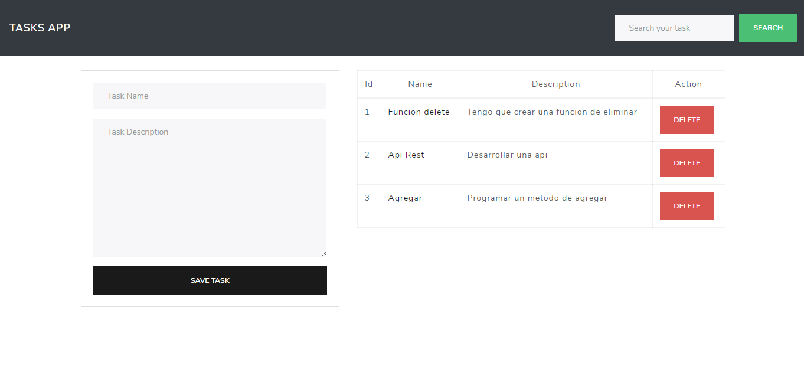

# App CRUD con PHP y AJAX
Aplicación usando PHP, Ajax Y MySQL.

Tecnologías:
- PHP.
- JS
- MySQL.

Esta app puede:
- Tasks: Crear/Leer/Actualizar/Eliminar.
- Buscar task.

# Screenshot

# Guía de instalación
1. Descarga el repositorio.
2. Descomprime la carpeta dentro del directorio que desees(Laragon, Valet, Xampp o WampServer).
3. Renombra la carpeta (Opcional).
4. Define los datos de conexión de la DB.
5. Abre la aplicación en el navegador con `http://localhost:tu-puerto/index.php`.

# License

#### Todos los proyectos creados por Alex Ku Dzul están bajo la [licencia MIT](https://opensource.org/licenses/MIT).